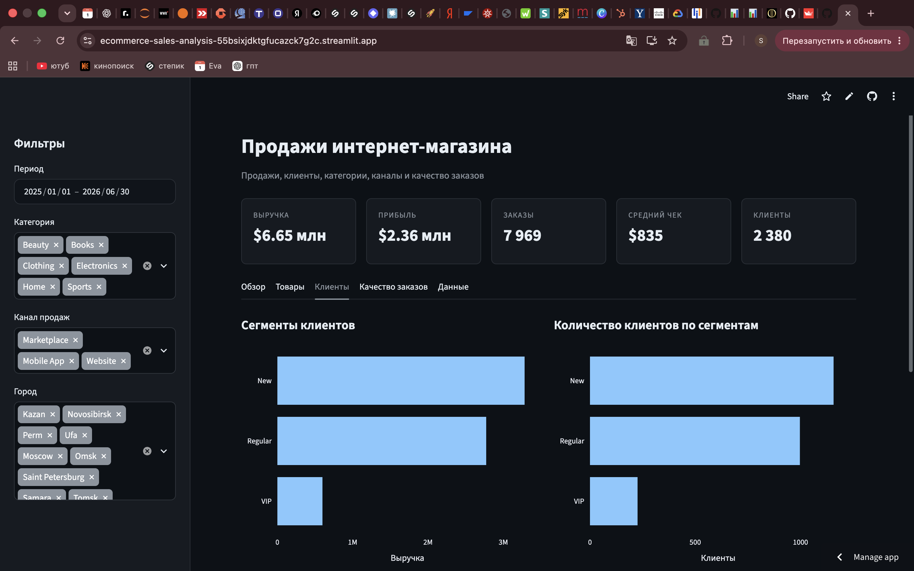

# Анализ продаж интернет-магазина

Интерактивный аналитический проект по исследованию продаж интернет-магазина с использованием Python, pandas, SQL, SQLite и Streamlit.

Проект охватывает полный цикл работы с данными: от загрузки и очистки исходных CSV-файлов до расчёта бизнес-метрик, анализа продаж и публикации интерактивного dashboard.

## Онлайн-версия

**Интерактивный dashboard:**  
https://ecommerce-sales-analysis-55bsixjdktgfucazck7g2c.streamlit.app/

## Dashboard



---

## Цель проекта

Цель проекта — исследовать продажи интернет-магазина и ответить на основные бизнес-вопросы:

- как меняется выручка со временем;
- какие категории приносят больше всего выручки и прибыли;
- какие товары продаются лучше всего;
- какие каналы продаж являются основными;
- какие города формируют наибольший объём продаж;
- как распределяется клиентская база;
- каков средний чек;
- какая доля заказов отменяется и возвращается;
- какие направления можно изучить для дальнейшего улучшения бизнес-показателей.

---

## Используемые технологии

- Python
- pandas
- NumPy
- Matplotlib
- Plotly
- SQL
- SQLite
- Jupyter Notebook
- Streamlit
- Git
- GitHub

---

## Данные

В проекте используется синтетический набор данных интернет-магазина.

Период анализа:

**01.01.2025 — 30.06.2026**

Исходные данные состоят из четырёх связанных таблиц.

### `customers.csv`

Информация о клиентах:

- `customer_id` — идентификатор клиента;
- `customer_name` — имя клиента;
- `city` — город;
- `segment` — клиентский сегмент;
- `signup_date` — дата регистрации.

Размер исходной таблицы: около **2 500 записей**.

### `products.csv`

Каталог товаров:

- `product_id`;
- `product_name`;
- `category`;
- `list_price`;
- `unit_cost`.

Количество товаров: **180**.

### `orders.csv`

Информация о заказах:

- `order_id`;
- `customer_id`;
- `order_date`;
- `channel`;
- `payment_method`;
- `status`.

Количество заказов: **9 000**.

### `order_items.csv`

Товарные позиции внутри заказов:

- `line_id`;
- `order_id`;
- `product_id`;
- `quantity`;
- `unit_price`;
- `discount_pct`.

Количество товарных позиций: **22 632**.

---

## Подготовка данных

Перед анализом была проведена проверка качества данных.

Выполнены:

- проверка структуры таблиц;
- анализ типов данных;
- поиск пропущенных значений;
- поиск дубликатов;
- удаление полных дубликатов клиентов;
- обработка пропущенных городов;
- преобразование дат в `datetime`;
- проверка идентификаторов клиентов, товаров и заказов;
- объединение таблиц через `merge`;
- создание итоговой аналитической таблицы.

Для дальнейшего анализа были рассчитаны дополнительные показатели:

- выручка;
- себестоимость;
- прибыль;
- маржинальность;
- месяц заказа;
- количество уникальных заказов;
- количество уникальных клиентов.

Итоговый очищенный набор данных сохраняется в:

`data/processed/sales_clean.csv`

---

## Методика расчёта

Основные финансовые показатели рассчитываются только по заказам со статусом:

`Completed`

Отменённые и возвращённые заказы анализируются отдельно.

### Выручка

Выручка рассчитывается как:

`quantity × unit_price`

### Себестоимость

`quantity × unit_cost`

### Прибыль

`revenue - cost`

### Средний чек

`общая выручка / количество завершённых заказов`

---

# Основные KPI

За анализируемый период:

| Показатель | Значение |
|---|---:|
| Выручка | **$6,65 млн** |
| Прибыль | **$2,36 млн** |
| Завершённые заказы | **7 969** |
| Уникальные клиенты | **2 380** |
| Средний чек | **$835,02** |
| Доля завершённых заказов | **88,54%** |
| Доля отмен | **6,49%** |
| Доля возвратов | **4,97%** |

Прибыль составляет около **35,5% от выручки**.

---

# Анализ категорий

Результаты по завершённым заказам:

| Категория | Выручка | Прибыль | Продано единиц |
|---|---:|---:|---:|
| Clothing | $1 355 213 | $525 058 | 6 833 |
| Home | $1 186 865 | $433 423 | 6 720 |
| Books | $1 100 468 | $380 374 | 6 727 |
| Beauty | $1 065 105 | $363 819 | 6 609 |
| Electronics | $981 883 | $315 027 | 6 624 |
| Sports | $964 746 | $344 833 | 6 465 |

### Вывод

Категория **Clothing** занимает первое место одновременно по:

- выручке;
- абсолютной прибыли;
- количеству проданных единиц.

При этом продажи относительно равномерно распределены между несколькими категориями — магазин не зависит только от одного товарного направления.

---

# Каналы продаж

| Канал | Выручка | Заказы | Прибыль |
|---|---:|---:|---:|
| Website | $3 017 049 | 3 581 | $1 064 423 |
| Mobile App | $2 635 480 | 3 186 | $939 986 |
| Marketplace | $1 001 750 | 1 202 | $358 126 |

### Вывод

Основным каналом является **Website**.

На него приходится около **45% общей выручки**.

На втором месте находится **Mobile App**, который формирует около **40% выручки**.

Marketplace значительно уступает собственным каналам магазина и обеспечивает примерно **15% выручки**.

Website и Mobile App вместе формируют основную часть продаж.

---

# География продаж

Топ городов по выручке:

| Город | Выручка | Заказы | Клиенты |
|---|---:|---:|---:|
| Москва | $1 976 154 | 2 379 | 711 |
| Санкт-Петербург | $1 243 052 | 1 482 | 437 |
| Новосибирск | $604 248 | 714 | 214 |
| Казань | $467 511 | 556 | 161 |
| Екатеринбург | $460 324 | 581 | 178 |
| Уфа | $403 082 | 494 | 139 |
| Самара | $400 069 | 457 | 144 |
| Томск | $372 846 | 432 | 131 |
| Пермь | $355 908 | 423 | 126 |
| Омск | $308 748 | 370 | 114 |

### Вывод

**Москва** является крупнейшим рынком интернет-магазина.

На Москву приходится около **$1,98 млн выручки**, 2 379 заказов и 711 клиентов.

На втором месте находится Санкт-Петербург с выручкой около **$1,24 млн**.

Москва и Санкт-Петербург вместе формируют почти половину общей выручки магазина.

---

# Топ товаров

Топ-10 товаров по выручке:

| Товар | Выручка | Прибыль | Продано единиц |
|---|---:|---:|---:|
| Dress Z72 | $82 306 | $36 242 | 285 |
| Cream E38 | $82 015 | $26 623 | 266 |
| Guide Z37 | $78 824 | $21 486 | 280 |
| Jeans R19 | $78 419 | $29 421 | 249 |
| Jeans Z52 | $78 022 | $32 372 | 255 |
| Sneakers E67 | $76 380 | $28 070 | 238 |
| Yoga Mat S93 | $76 256 | $14 326 | 238 |
| Blanket I22 | $74 735 | $34 470 | 228 |
| Backpack O10 | $73 293 | $22 814 | 239 |
| Mouse W86 | $71 329 | $33 838 | 219 |

### Вывод

Лидером по выручке является **Dress Z72**:

- выручка — около **$82,3 тыс.**;
- прибыль — около **$36,2 тыс.**;
- продано 285 единиц.

При этом разрыв между товарами первой десятки относительно небольшой.

Это говорит о том, что продажи распределены между несколькими SKU, а не концентрируются вокруг одного единственного товара.

---

# Клиентские сегменты

В данных используются три клиентских сегмента:

- New;
- Regular;
- VIP.

По выручке крупнейшую долю формируют новые клиенты, далее идут постоянные клиенты.

VIP-сегмент занимает значительно меньшую долю клиентской базы и выручки.

Dashboard позволяет отдельно сравнивать:

- выручку сегментов;
- количество клиентов в каждом сегменте.

---

# Качество заказов

Всего в исходных данных:

**9 000 заказов**

Распределение по статусам:

| Статус | Заказы | Доля |
|---|---:|---:|
| Completed | 7 969 | 88,54% |
| Cancelled | 584 | 6,49% |
| Returned | 447 | 4,97% |

### Вывод

Большинство заказов успешно завершается.

При этом около **11,46% заказов** суммарно приходится на отмены и возвраты.

Это отдельная область для дальнейшего исследования, поскольку снижение доли отмен и возвратов может напрямую влиять на фактическую выручку бизнеса.

---

# Основные выводы

1. За анализируемый период интернет-магазин получил около **$6,65 млн выручки** и **$2,36 млн прибыли**.

2. Было успешно завершено **7 969 заказов**, а средний чек составил около **$835**.

3. Категория **Clothing** является лидером как по выручке (**$1,36 млн**), так и по абсолютной прибыли (**$525 тыс.**).

4. Главным каналом продаж является **Website** с выручкой около **$3,02 млн**.

5. **Mobile App** также играет значительную роль и приносит около **$2,64 млн выручки**.

6. Marketplace значительно уступает собственным каналам магазина по объёму продаж.

7. **Москва** является крупнейшим рынком: около **$1,98 млн выручки**, 2 379 заказов и 711 клиентов.

8. Наиболее продаваемый по выручке товар среди отдельных SKU — **Dress Z72** с выручкой около **$82,3 тыс.**

9. Доля отменённых заказов составляет **6,49%**.

10. Доля возвращённых заказов составляет **4,97%**.

11. Около **88,5% заказов успешно завершаются**.

12. Продажи распределены между несколькими категориями и товарами, поэтому бизнес не демонстрирует критической зависимости от одного конкретного SKU.

---

# Рекомендации

На основе результатов анализа можно выделить несколько направлений для дальнейшего исследования.

### 1. Детализировать анализ категории Clothing

Clothing лидирует одновременно по выручке и прибыли.

Следующим этапом стоит определить:

- какие товары внутри категории формируют основной объём продаж;
- какие товары имеют максимальную маржинальность;
- какие товары чаще возвращаются.

### 2. Сравнить эффективность каналов продаж

Website и Mobile App обеспечивают основную часть выручки.

Для полноценной оценки эффективности каналов дополнительно стоит учитывать:

- стоимость привлечения клиента;
- маркетинговые расходы;
- средний чек;
- частоту повторных покупок;
- прибыль на заказ.

### 3. Изучить Marketplace

Marketplace значительно уступает Website и Mobile App.

Необходимо определить, связано ли это с:

- меньшим количеством клиентов;
- ассортиментом;
- комиссией площадки;
- ценами;
- меньшим объёмом маркетинга.

### 4. Исследовать причины отмен

Доля отмен составляет **6,49%**.

Можно проверить связь отмен с:

- каналом продаж;
- способом оплаты;
- категорией товара;
- городом;
- размером заказа.

### 5. Исследовать возвраты

Доля возвратов составляет **4,97%**.

Следующим шагом может быть анализ возвратов по:

- категориям;
- товарам;
- клиентским сегментам;
- каналам продаж.

### 6. Исследовать эффективность скидок

В наборе данных присутствует информация о размере скидки.

Можно отдельно проверить:

- увеличивается ли количество проданных товаров при росте скидки;
- как скидки влияют на прибыль;
- существует ли уровень скидки, после которого продажи почти не растут.

### 7. Исследовать географическую концентрацию

Москва и Санкт-Петербург формируют значительную часть общей выручки.

Можно отдельно сравнить:

- средний чек по городам;
- количество заказов на клиента;
- прибыльность регионов;
- потенциал роста менее крупных городов.

---

# Интерактивный Dashboard

Dashboard разработан с использованием Streamlit и Plotly.

В интерфейсе доступны фильтры:

- период;
- категория товара;
- канал продаж;
- город.

Все KPI, графики и таблицы автоматически пересчитываются при изменении фильтров.

Dashboard разделён на несколько вкладок.

### Обзор

Содержит:

- основные KPI;
- динамику выручки;
- продажи по категориям;
- продажи по каналам.

### Товары

Содержит:

- топ-10 товаров;
- сравнение выручки и прибыли категорий.

### Клиенты

Содержит:

- клиентские сегменты;
- количество клиентов по сегментам;
- географию продаж.

### Качество заказов

Содержит:

- количество завершённых заказов;
- количество отмен;
- долю отмен;
- долю возвратов;
- структуру заказов.

### Данные

Позволяет:

- посмотреть отфильтрованный набор данных;
- скачать данные в CSV.

---

# SQL

Помимо анализа в pandas, проект содержит SQLite-базу данных:

`data/ecommerce.db`

SQL-запросы находятся в:

`sql/01_analysis.sql`

С помощью SQL анализируются:

- количество заказов;
- количество клиентов;
- распределение заказов по статусам;
- продажи по каналам;
- выручка по месяцам;
- выручка по категориям;
- средний чек;
- топ клиентов;
- отмены и возвраты.

---

# Структура проекта

```text
ecommerce-sales-analysis/
│
├── app.py
│
├── .streamlit/
│   └── config.toml
│
├── data/
│   ├── raw/
│   │   ├── customers.csv
│   │   ├── products.csv
│   │   ├── orders.csv
│   │   └── order_items.csv
│   │
│   ├── processed/
│   │   └── sales_clean.csv
│   │
│   └── ecommerce.db
│
├── notebooks/
│   └── 01_sales_analysis.ipynb
│
├── sql/
│   └── 01_analysis.sql
│
├── src/
│   └── build_db.py
│
├── reports/
│   └── figures/
│       └── dashboard.png
│
├── requirements.txt
├── .gitignore
└── README.md